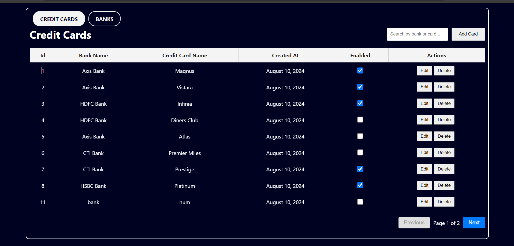

# Pneuma-Web

This website is a simple admin dashboard for managing credit cards.

## Project Setup

1. **Clone the Repository:**

   ```bash
   git clone https://github.com/BalajiDyavanpalli7030/pneuma-web.git pneuma-web
2. **Backend Setup:**

   ```bash
   cd backend
   npm install

   ```
   2.1 **Create a .env file and add your database details:**

   ```env
   DB_HOST=127.0.0.1
   DB_USER=root
   DB_PASSWORD=
   DB_NAME=pneuma
   ```
3. **MySQL Setup:**
   Create the pneuma database:
   ```sql
   CREATE DATABASE pneuma;
   USE pneuma;
   ```
   Create the CreditCards table:
   ```sql
      CREATE TABLE CreditCards (
     id INT AUTO_INCREMENT PRIMARY KEY,
     bank_name VARCHAR(255) NOT NULL,
     credit_card_name VARCHAR(255) NOT NULL,
     created_at TIMESTAMP DEFAULT CURRENT_TIMESTAMP,
     enabled BOOLEAN DEFAULT TRUE
   );
4. **Run the Backend:**
   ```bash
   npm run dev
   
5. **Frontend Setup:**
   ```bash
   cd frontend
   npm install
   npm start

Visit http://localhost:3000 in your browser to see dashboard.

## Technologies Used

- React.js for the frontend (utilizing JSX for component structure)
- CSS for styling
- ExpressJS for the backend
- MYSQL for data storage


